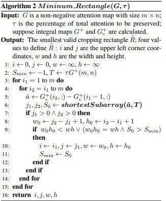
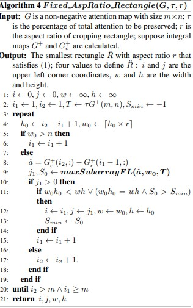

### Image Processing Algorithm:

- Algorithm reference from [!hackerEarth](https://www.hackerearth.com/practice/notes/image-cropping-and-scaling-algorithm-using-linear-algebra/)
- example [!reference](https://learnopencv.com/cropping-an-image-using-opencv/)
- reference [!newsletter](https://neptune.ai/blog/image-processing-python)
- sample reference for code from [!reference](https://github.com/silvia-odwyer/photon/blob/master/crate/src/transform.rs)
- web app inconsideration of [!reference](https://docs.rs/photon-rs/latest/photon_rs/)
- [!notes](http://poseidon.csd.auth.gr/LAB_PUBLICATIONS/Books/dip_material/chapter_2/chap2en.pdf) on image-processing.
- [!book](http://kiwi.bridgeport.edu/cpeg585/Algorithms_for_Image_Processing_and_Computer_Vision.pdf) in reference to image-processing adn algorithms.
- research in [!reference](https://openaccess.thecvf.com/content_cvpr_2016/papers/Chen_Automatic_Image_Cropping_CVPR_2016_paper.pdf)

- 
- 
